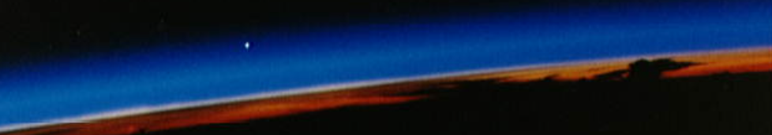

### Hi there, I'm Mateus Figueiredo👋
<div style="display: flex; flex-direction: column;">
  
  <div align="center"><p><strong>Venus On The Horizon</strong> - <a href="https://www.nasa.gov/">NASA</a> photo from October 14, 1997 - <i>day I was born</i></p></div>
</div>

```js
const FunsfactsAboutMe = [
  'I had a rock band',
  'Regional Champion of the Brazilian Robotics Olympics in 2016',
  'Arduino lover'
];

const Technologies = {
  front: ['HTML5', 'CSS3', 'JAVASCRIPT', 'REACT', 'STYLED-COMPONENTS'],
  back: ['NODE.JS', 'TYPESCRIPT', 'EXPRESS.JS', 'POSTGRESQL', 'JEST', 'DOCKER', 'PRISMA'],
  tools: ['GIT', 'TRELLO', 'ESLINT', 'SLACK', 'NPM', 'VS CODE', 'LINUX', 'FIGMA'],
  cloud: ['VERCEL', 'HEROKU', 'AMAZON AWS']
}
```
